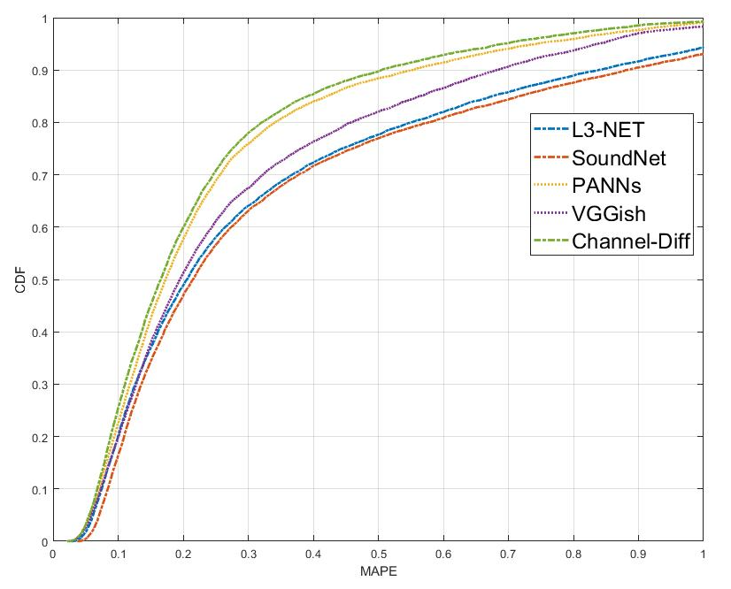
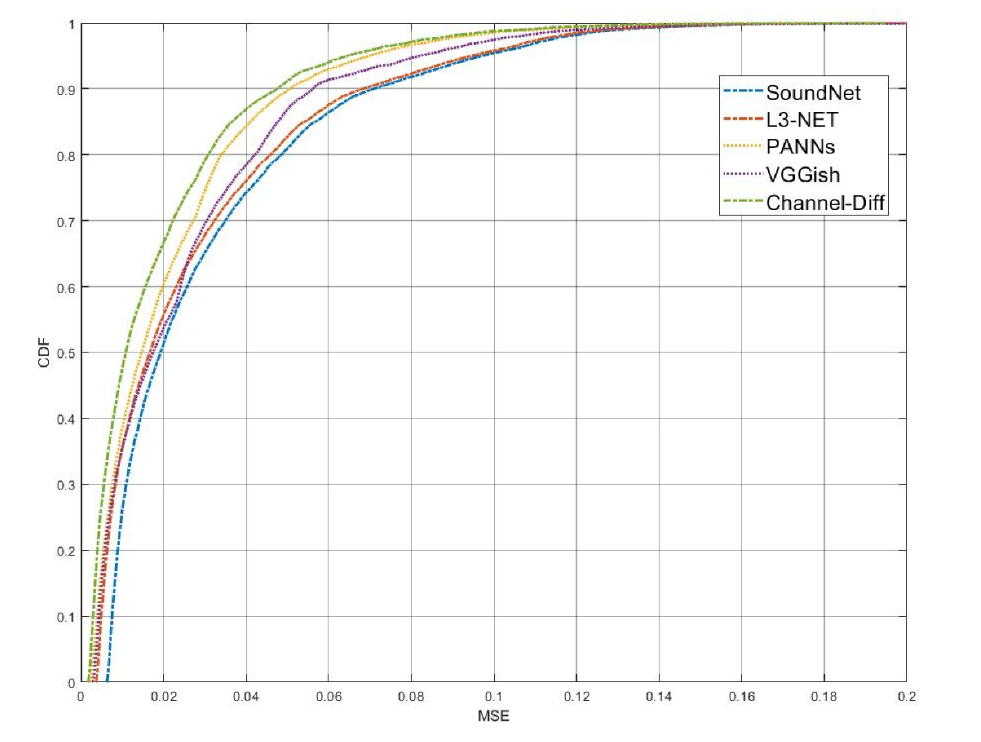
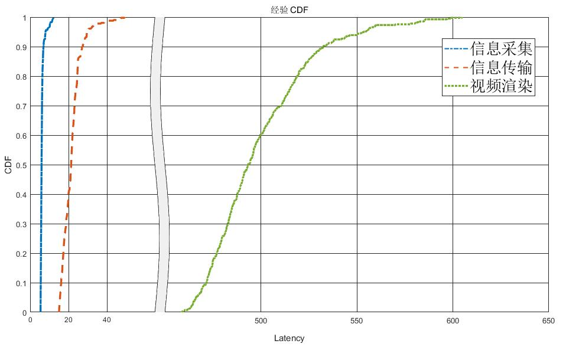
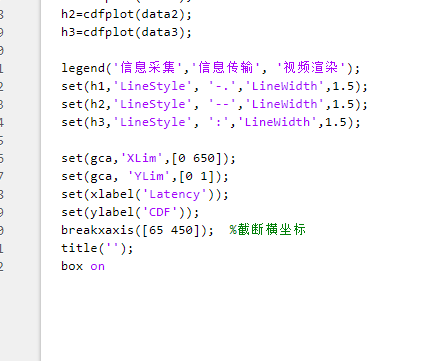

# CDF图
概率分布图，能够看出数据的分布情况  
## 样例图示
  
  
  

## 样例项目地址  
前两个图示的项目  
[样例](%E6%A0%B7%E4%BE%8B.m)  
第三个图示的项目  
[样例2](%E6%A0%B7%E4%BE%8B2.m)  

## 作图流程演示
代码中，使用csvread方法，读取csv文件，参数第一个是文件，第二个和第三个是行和列的开始，第四个参数是[start_x, start_y, end_x, end_y]  
若要得到第三个图示的项目，需要阶段横轴，使用breakxaxis方法  
  