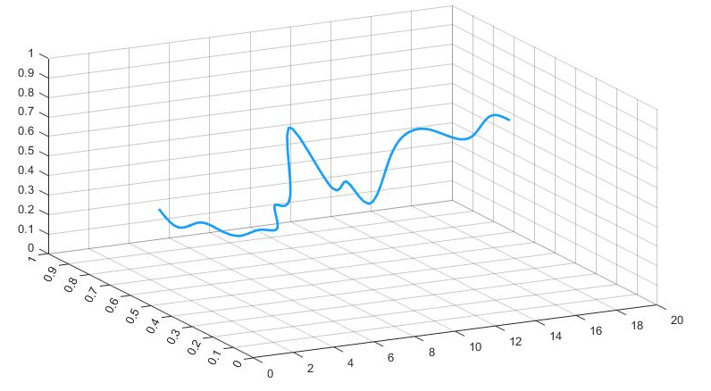
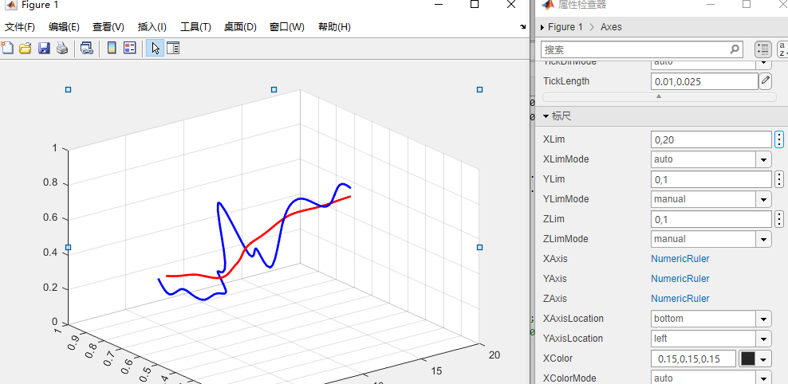
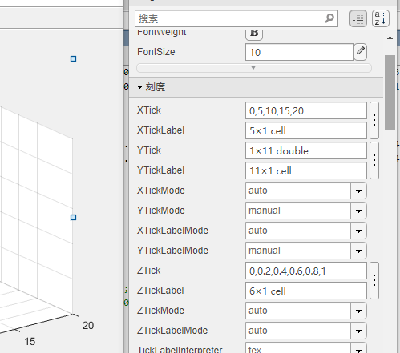
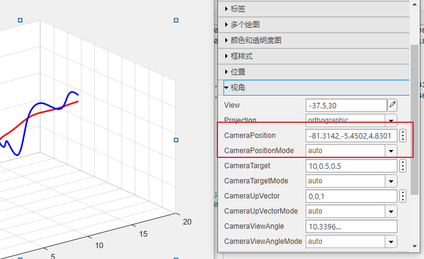

# 曲线图
多个数据点连成的曲线图  
## 样例图示
  
## 样例项目地址  
[样例](%E6%A0%B7%E4%BE%8B.m)  

## 作图流程演示
代码中，x,y,z与a,b,c中是要绘制的数据点，然后变为xyz abc对象  
之后调用库函数绘制  
值得注意的是，需要对图进行很多调整  
首先需要对标尺进行修改为0-1  
  
而后，对刻度进行处理  
  
最后改变视角方向，使得图好看  
  
