# 总体知识
matplotlib的图是画在**figure**上, 每个figure包含了一个或多个**axes**(一个可以指定坐标系的子区域)  
## figure
figure一般包含四个层级，也称为容器(container)
1. Figure: 顶层级 容纳所有绘图元素
2. Axes: matplotlib的核心 容纳了大量元素来构成的子图 一个figure由一个或多个子图构成
3. Axis: axes的下属层级 处理所有和坐标轴 网格有关的元素
4. Tick: axis的下属层级 处理和刻度有关的元素

**figure的总体图示**：  
  

# 各章节细节
## chapter1
见[chapter1](chapter1.ipynb)  
### 面向对象与面向过程
面向对象:  
```python
plt, ax = plt.subplots() # 显示定义画图对象ax
ax.apis()               # 使用画图对象的api进行使用
plt.show()
```
面向过程:  
```python
plt.api()              # 直接使用plt.api进行画图
plt.show()
```
### 通用绘图模板
1. 准备数据
2. 设置绘图样式 (非必须在这里设置 可以再绘图细节部分进行设置)
3. 定义布局
4. 绘制图像
5. 添加标签 文字 图例

```python
# step1 准备数据
x = np.linspace(0, 2, 100)
y = x ** 2

# step2 设置绘图样式 (非必须在这里设置 可以再绘图细节部分进行设置)
mpl.rc('lines', linewidth = 4, linestyle = '-.')

# step3 定义布局
fig, ax = plt.subplots()

# step4 绘制图像
ax.plot(x, y, label = 'line')

# step5 添加标签 文字 图例
ax.set_xlabel('x label')
ax.set_ylabel('y label')
ax.set_title("Simple Plot")
ax.legend()
```

## chapter2
见[chapter2](chapter2.ipynb)  
matplotlib的原理是 用Artist对象在画布(canvas)上绘制(render)图形  
这三步分别对应了三个层次的API：
1. matplotlib.backend_bases.FigureCanvas 代表了绘图区 所有图像都是在绘图区完成的
2. matplotlib.backend_bases.Renderer 代表了渲染器 可以理解为画笔
3. **matplotlib.artist.Artist 代表了图标组件**

**前两个部分处理程序和计算机底层的交互 第三层的Artist是具体调用的接口来作图**  
### Artist
Artist分为两种
1. primitives基本要素(曲线Line2D 文字text 矩形Rectangle 图像image)
2. 容器containers装基本要素的地方(图像figure 坐标系Axes 坐标轴Axis)

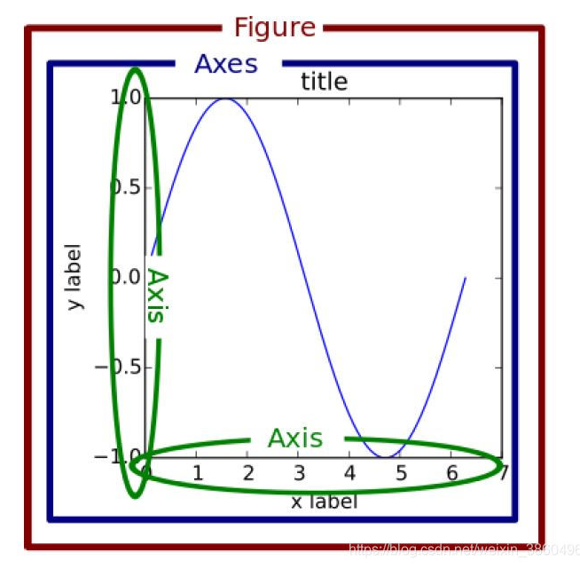  

### Line2D
2DLines主要是处理曲线的绘制 主要有直线line和误差折线图errorbar  
#### 直线line
绘制的api: plot() Line2D对象  

示例图：  
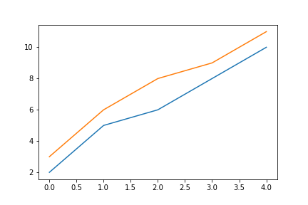  

#### 误差折线图errorbar
绘制的api: errorbar()  
示例图：  
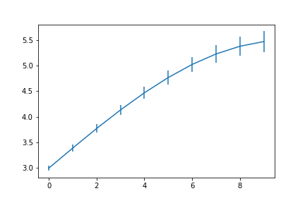  

### 矩形 直方图hist 柱状图bar
#### 直方图
**直方图是没有间隙的柱状图 一般是将所有数据按照不同的分区统计在各个区间的次数或者频率**  
绘制的api: hist() Rectangle对象  
示例图：  
纵轴为统计次数：  
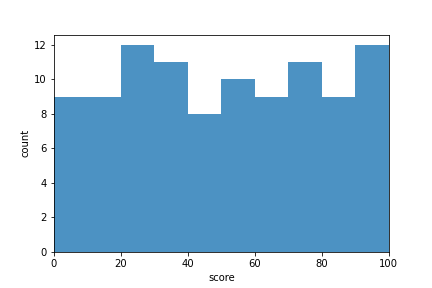  
纵轴为统计百分比：  
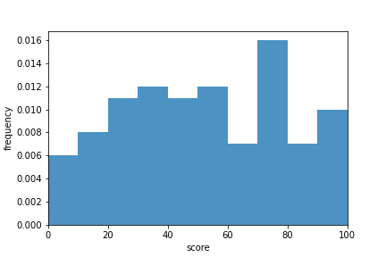  

#### 柱状图
**柱状图是对每个x位置的对应y值用与y轴等高的柱子进行表示**  
**直方图就是柱间距 = 1的柱状图 柱状图就是柱间距小于1的直方图**  
绘制的api: bar() Rectangle对象
示例图：  
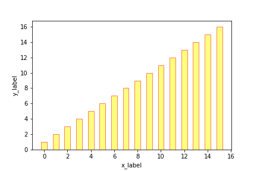  

### 多边形
绘制多边形  
绘制的api: fill()  
示例图：  
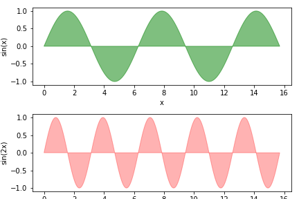  

### 楔形
楔形是类似于圆形的饼状图
#### 饼状图
绘制的api: pie()  
示例图：  
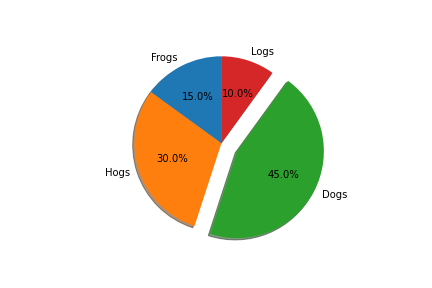  

### 楔形图
绘制的api: Wedge对象  
示例图：  
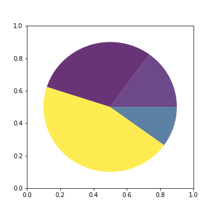  

### 散点图
散点图属于Collections的子类 是画一组对象集合的方法  
绘制的api: scatter()  
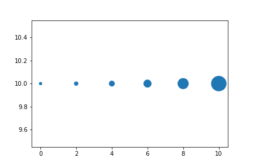  

### 图像images
绘制一个类似于矩阵对象的图  
绘制的api：imshow()  
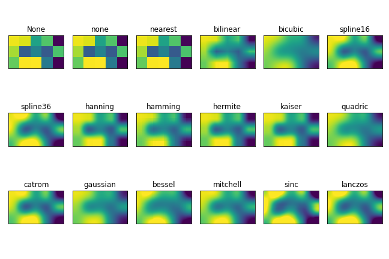  