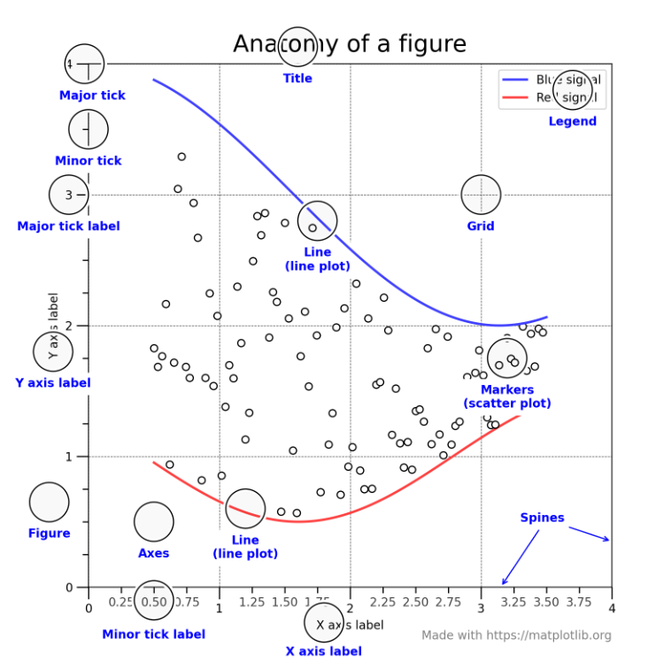

# 总体知识
matplotlib的图是画在**figure**上, 每个figure包含了一个或多个**axes**(一个可以指定坐标系的子区域)  
## figure
figure一般包含四个层级，也称为容器(container)
1. Figure: 顶层级 容纳所有绘图元素
2. Axes: matplotlib的核心 容纳了大量元素来构成的子图 一个figure由一个或多个子图构成
3. Axis: axes的下属层级 处理所有和坐标轴 网格有关的元素
4. Tick: axis的下属层级 处理和刻度有关的元素

**figure的总体图示**：  
  

# 各章节细节
## chapter1
### 面向对象与面向过程
面向对象:  
```python
plt, ax = plt.subplots() # 显示定义画图对象ax
ax.apis()               # 使用画图对象的api进行使用
plt.show()
```
面向过程:  
```python
plt.api()              # 直接使用plt.api进行画图
plt.show()
```
### 通用绘图模板
1. 准备数据
2. 设置绘图样式 (非必须在这里设置 可以再绘图细节部分进行设置)
3. 定义布局
4. 绘制图像
5. 添加标签 文字 图例

```python
# step1 准备数据
x = np.linspace(0, 2, 100)
y = x ** 2

# step2 设置绘图样式 (非必须在这里设置 可以再绘图细节部分进行设置)
mpl.rc('lines', linewidth = 4, linestyle = '-.')

# step3 定义布局
fig, ax = plt.subplots()

# step4 绘制图像
ax.plot(x, y, label = 'line')

# step5 添加标签 文字 图例
ax.set_xlabel('x label')
ax.set_ylabel('y label')
ax.set_title("Simple Plot")
ax.legend() ;
```