# 双坐标轴
左侧为一组数据的坐标轴，右侧为一组数据的坐标轴，但是每个样本均有左侧与右侧的数据。  
## 样例图示
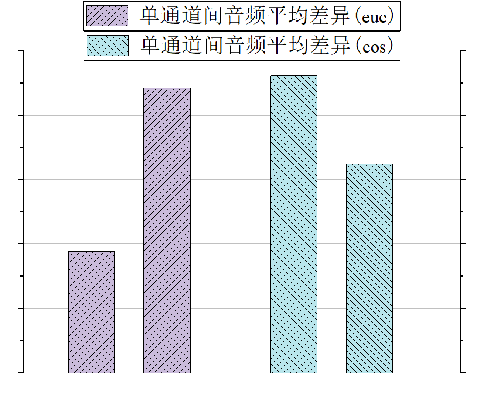  
此图是左边两轴看左坐标轴，右边两轴看右坐标轴。  
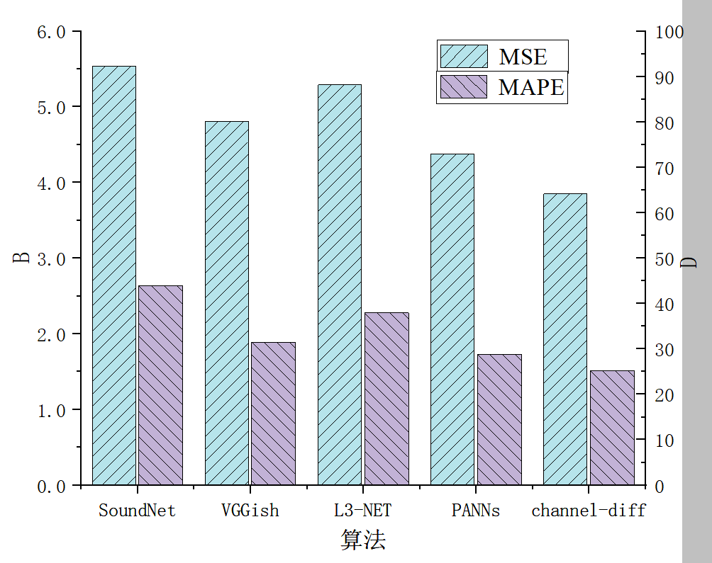  
此图是每个组里第一列看左坐标轴，第二列看右坐标轴。  
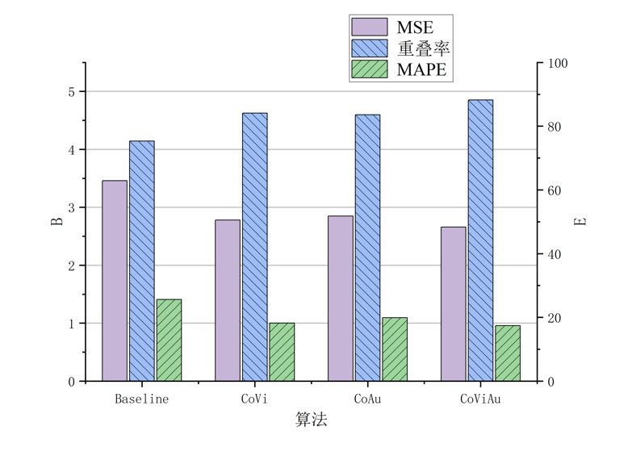  
此图第一列看左坐标轴，第二列和第三列看右坐标轴  

## 样例项目地址  
[样例1](%E6%A0%B7%E4%BE%8B1.opju)  
[样例2](%E6%A0%B7%E4%BE%8B2.opju)  
[样例3](%E6%A0%B7%E4%BE%8B3.opju)  

## 作图流程演示1
要达到样例图示的第一个图的效果。  
首先A列x轴的具体数值，只要留够空间即可，B列前两个数值有值，后两个为0。C列前两个为0，后两个有值  
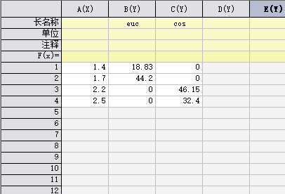  
首先，仅选取B轴，做一个柱状图  
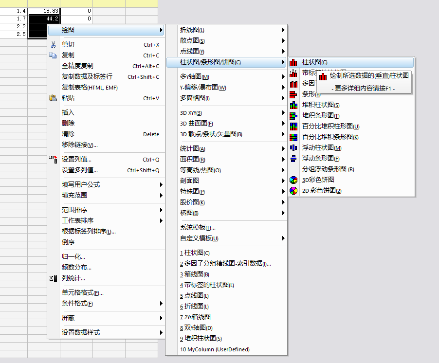  
之后，选择插入-新图层  
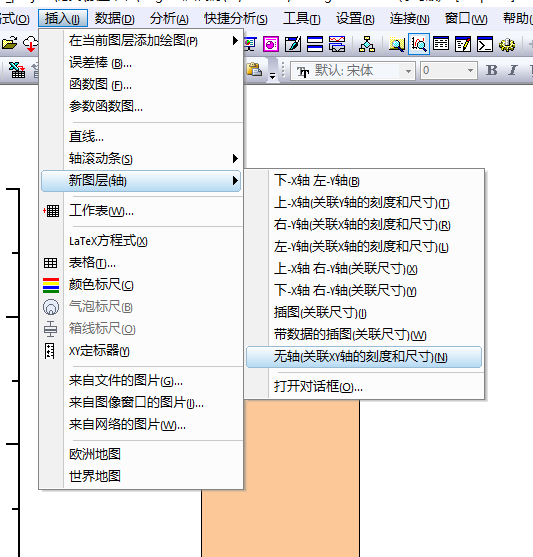  
此时已经在图层2了，回到数据侧选中C列的数据，  
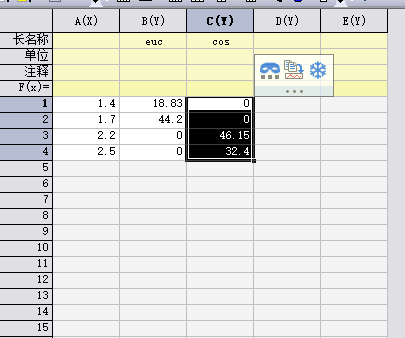  
回到图上，选择插入绘制一个柱状图  
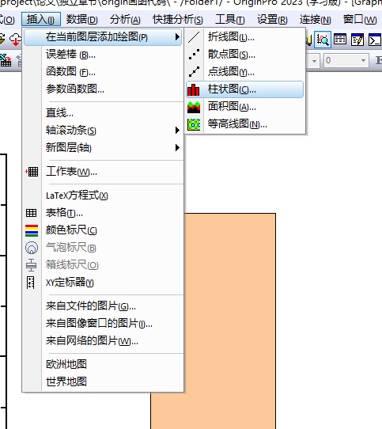  
之后将右侧轴显示出来  
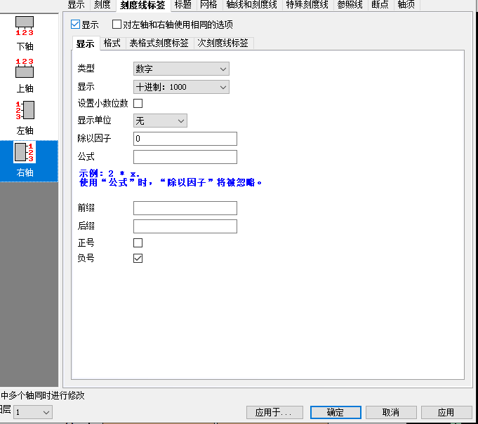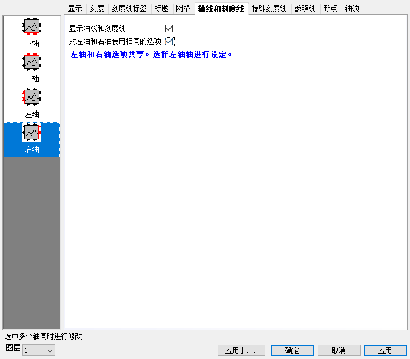  
后续调整属性即可  
## 作图流程演示2
要达到样例图示的第二个图的效果。  
首先，A轴是每个组的名称，B列为第一个指标的数据，C与D为空，E列为第二个指标的数据。  
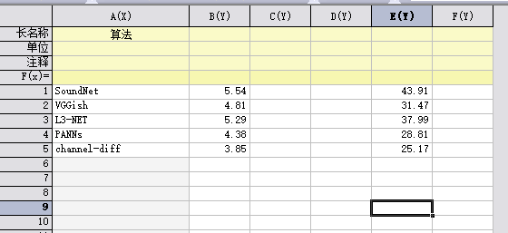  
之后，选择B与C轴，绘制一个柱状图。  
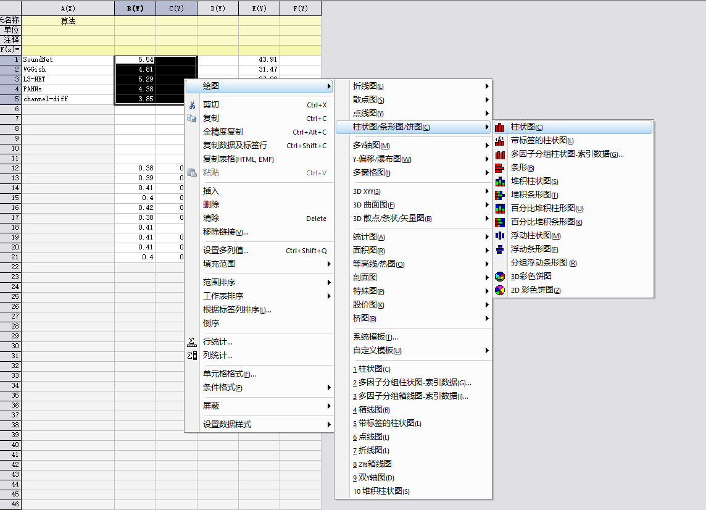  
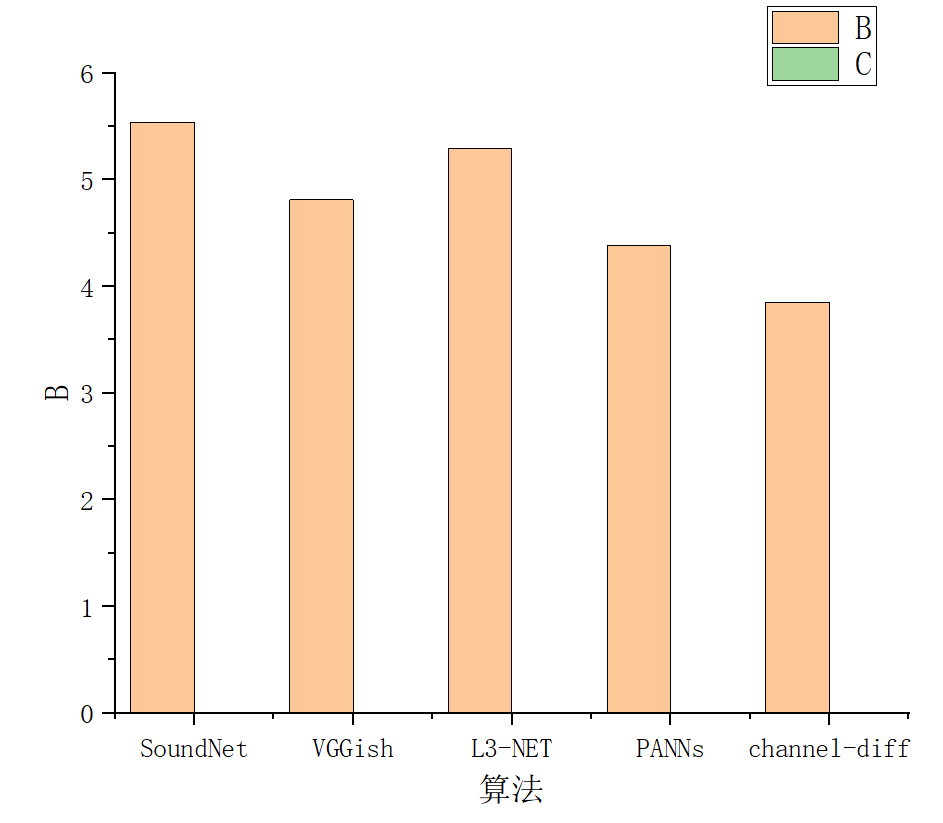  
此时得到的是每个组内左侧有值而右侧为空值。  
此时新建一个图层，注意此时需要是右轴的图层  
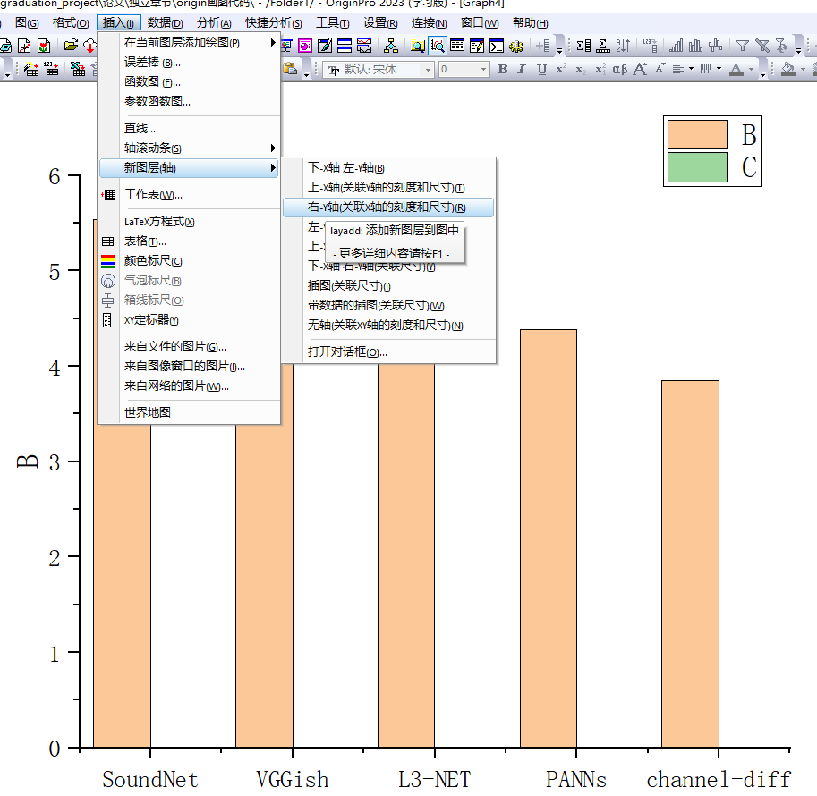  
回到数据表中选择D与E列  
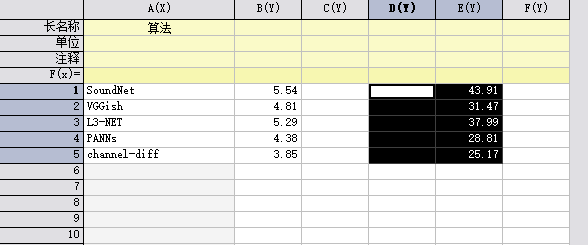  
回到图层2绘制柱状图  
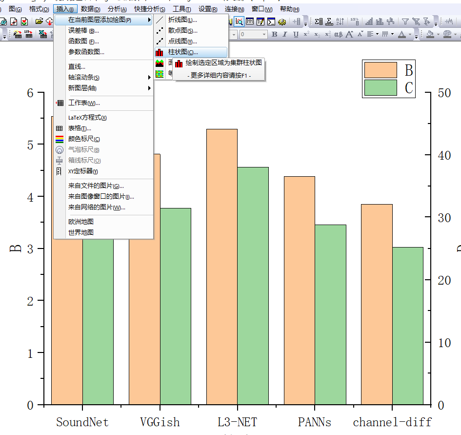  
最后单独调整坐标轴与颜色等内容即可。  

## 作图流程演示3
要达到样例图示的第三个图的效果。  
与样例图示2的区别是此时有三个空列  
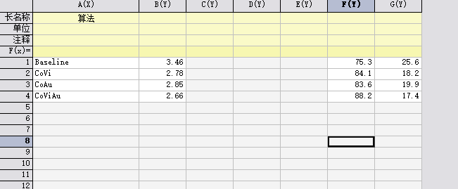  
首先以B和C画一个柱状图  
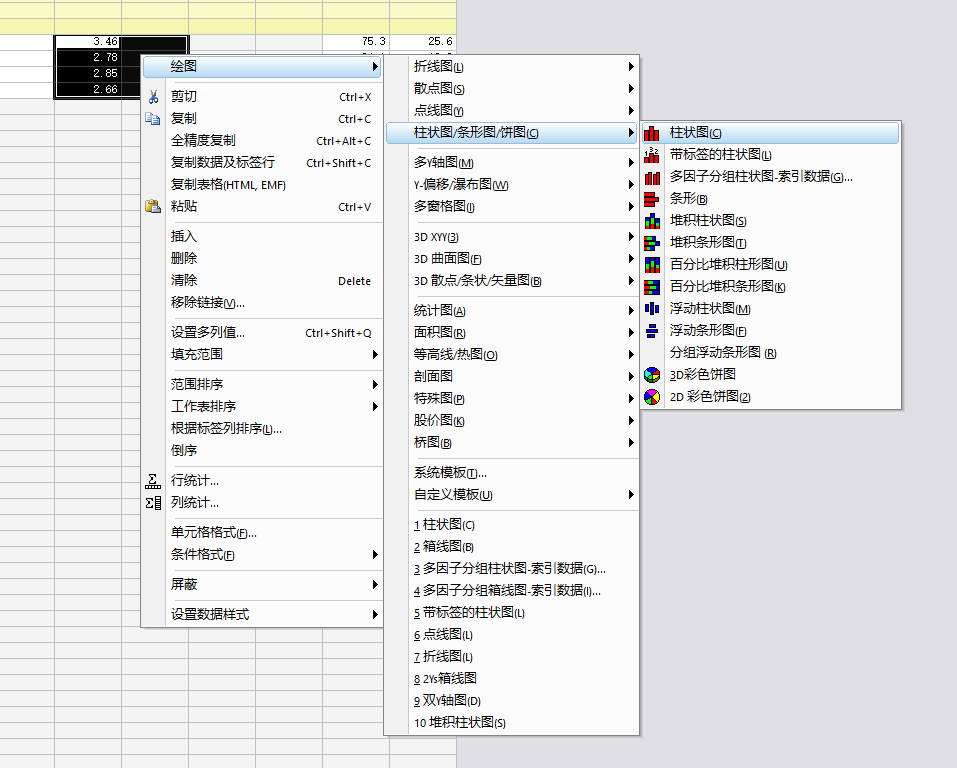  
之后构建右侧图层  
  
而后选中DEFG列  
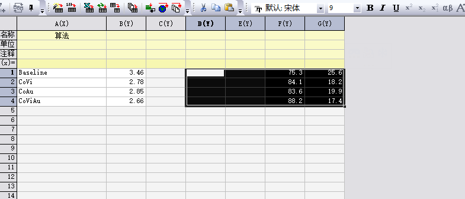  
插入柱状图即可，后续修改坐标轴颜色等内容即可  