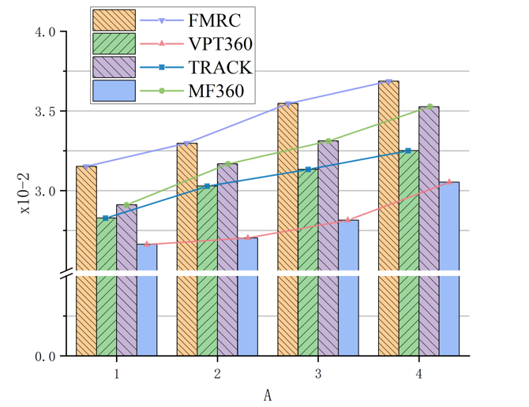
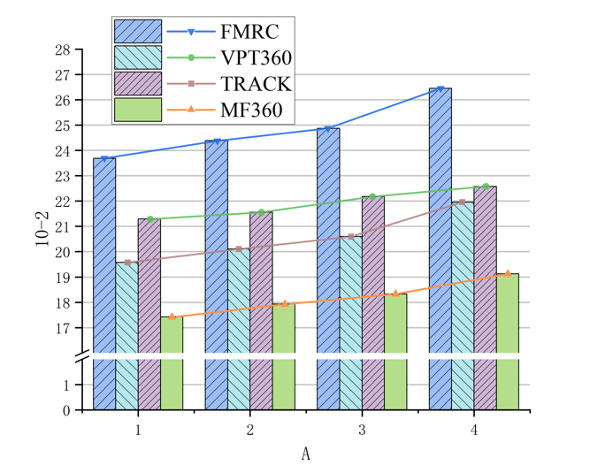
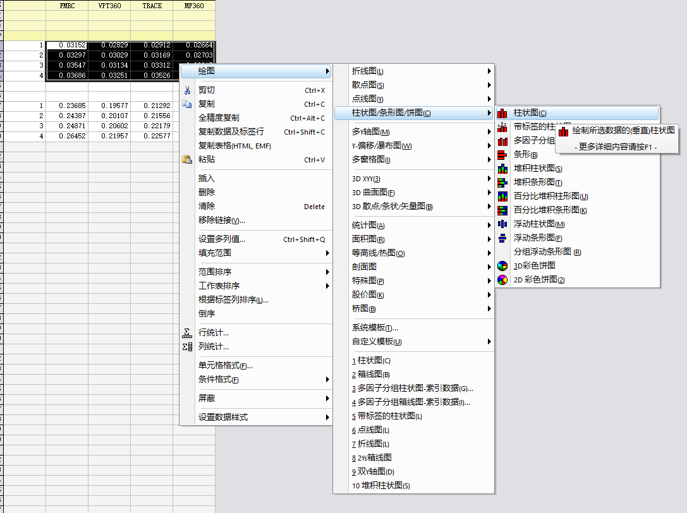
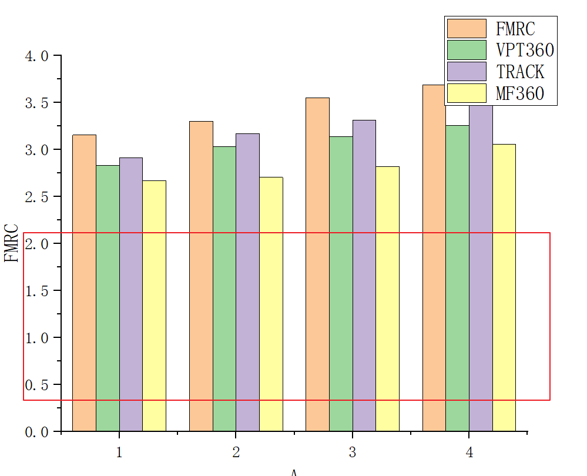
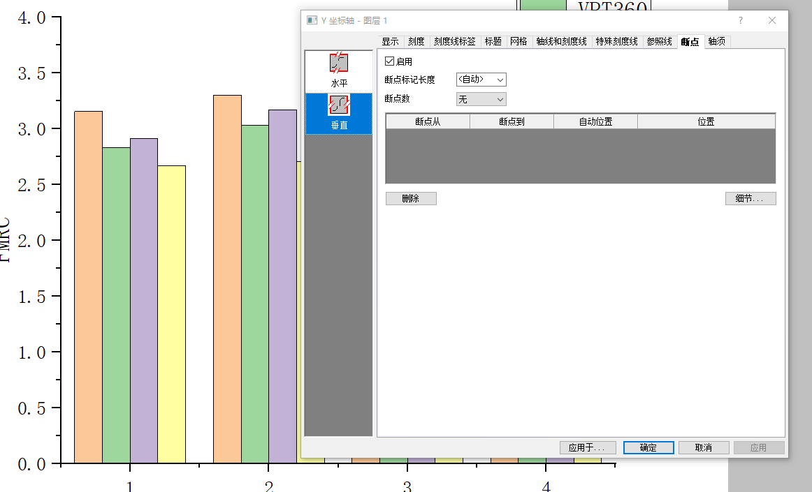
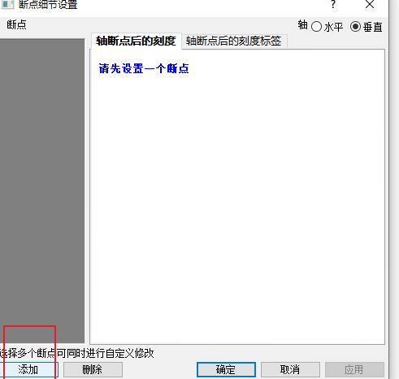
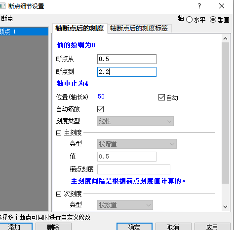
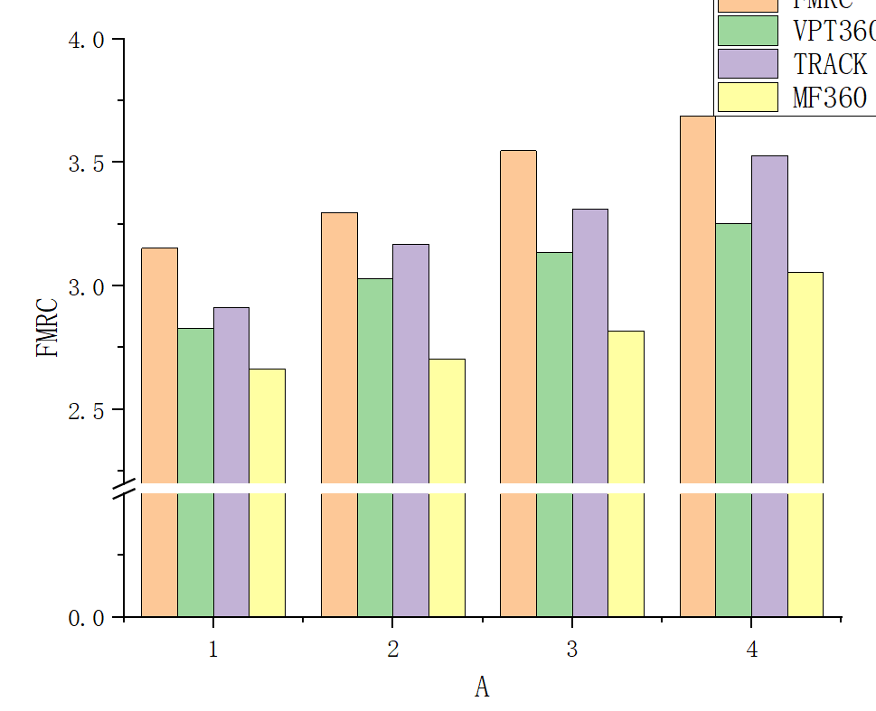
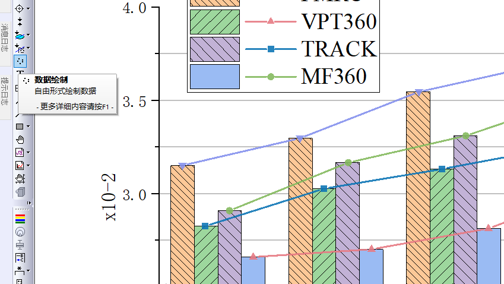

# 断点
断点是指在坐标轴上断开，使得没有意义的部分不被关注，使得图中差距变得明显的方法。  
## 样例图示
  
  

## 样例项目地址  
[样例](%E6%A0%B7%E4%BE%8B.opju)  

## 作图流程演示
首先拿所有数据绘制一个柱状图  
  
此时可以看到大部分区域都没有意义，而且由于高度过高导致各个差异并不明显  
  
双击坐标轴打开断点部分  
  
选择细节，添加一个断点  
  
设定断点区域  
  
得到轴断开的结果  
  
若要连线，则使用数据绘制，选择点线图即可  
  