# 箱形图
## 多因子分组箱形图
箱形图按照两种因子分组，即先按照A指标分组，组间又按照B指标分组。  
### 样例图示  
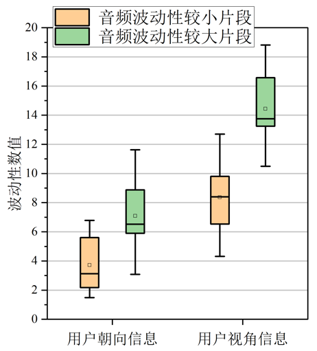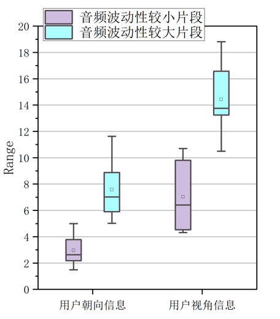  
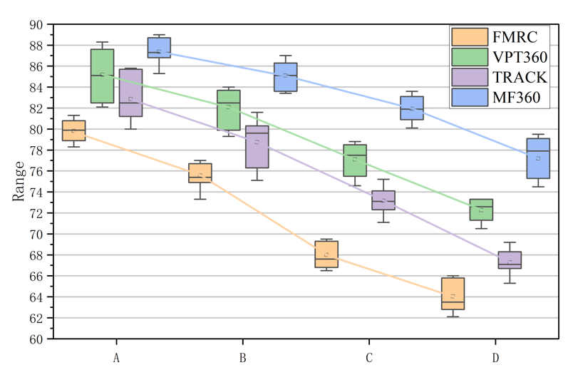  
### 样例项目地址  
[样例1](%E6%A0%B7%E4%BE%8B1.opju)  
[样例2](%E6%A0%B7%E4%BE%8B2.opju)  

### 作图流程演示
做一个双因子分组箱形图，数据分布列以A作为第一个因子，“长名称”为第二个因子。  
将数据进行排列分布：  
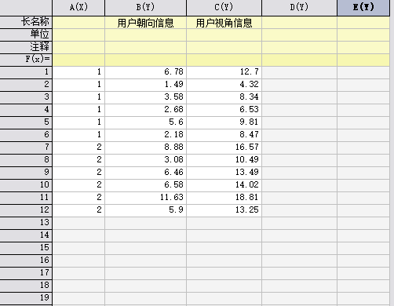  
其中1与2为第一个因子，朝向和视角为第二个因子。  
之后选取所有数据，邮件作图选择对应的选项。  
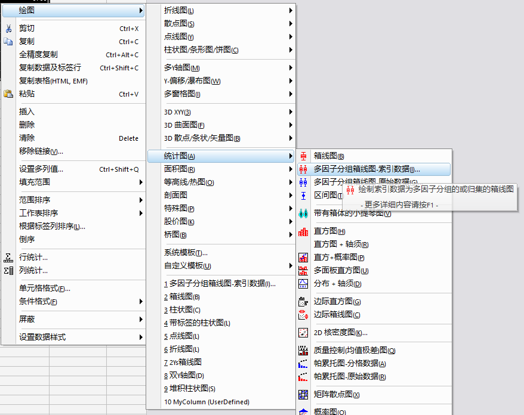  
在“分组列”上选择A列  
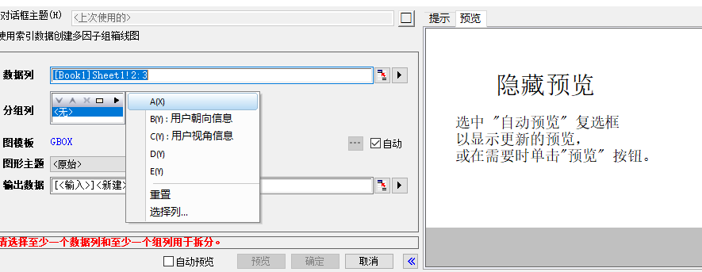  
同一组选择同一颜色，需要对箱体颜色选择逐个-在子组内。  
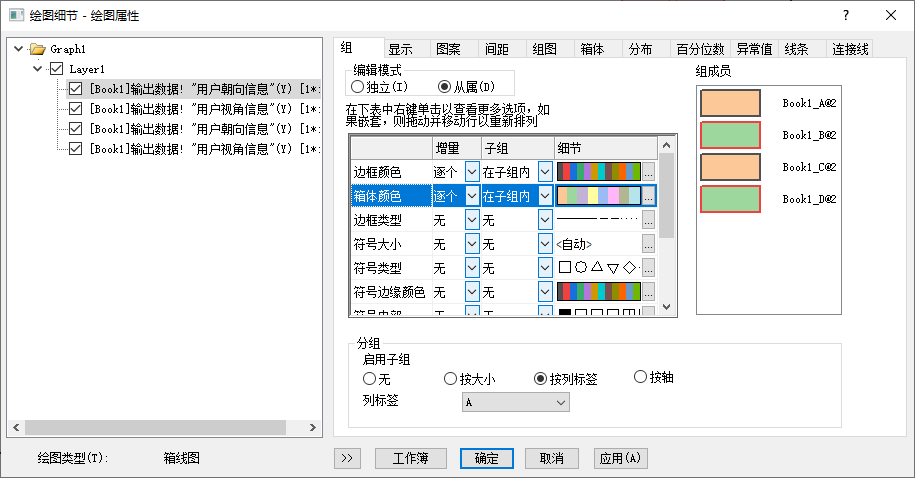  
调整间距，使得箱体宽度达到满意值  
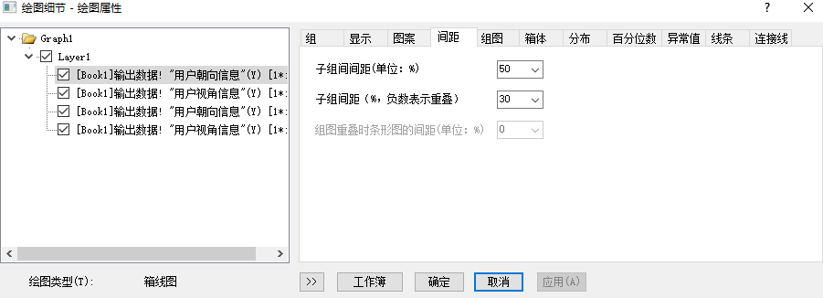  
在图例上，\l(1)与\l(2)代表每一种颜色  
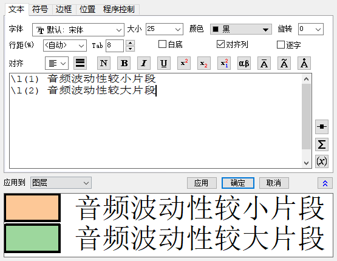  
若要对组内箱形连线，则使用“数据绘制”功能。  
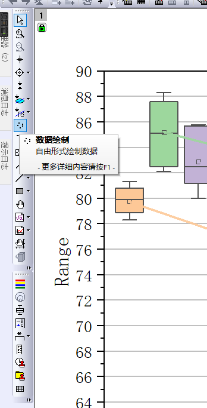  
对需要绘制的位置点点  
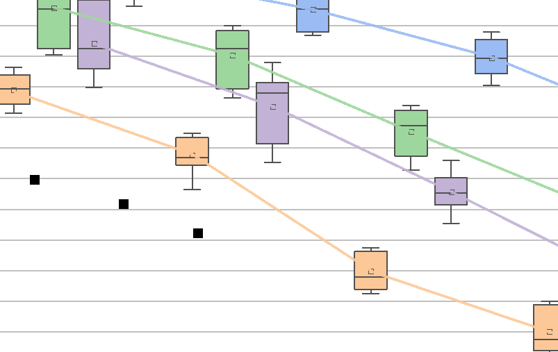  
最终对点线或者折线图进行属性处理即可。